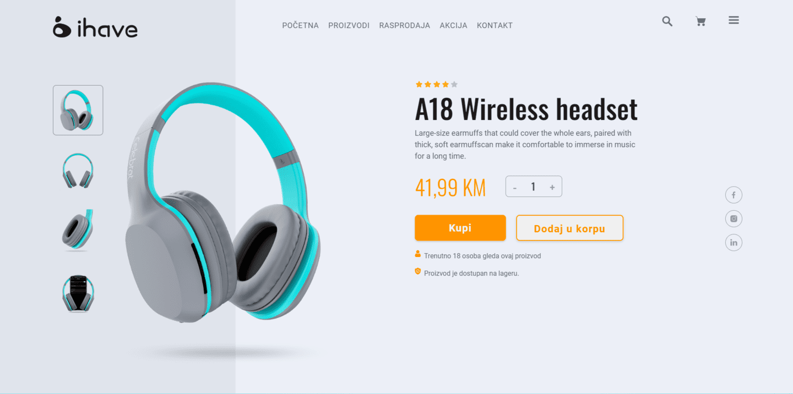

# ihave-trial-assignment

Live: [link](https://landingpage-5e1bb.web.app/)

This is example of Landing page. 
The situation was that I didn't have a nice example page before.
This case would allow me to demonstrate my experience with UI Design.
 
I got a job application task from my who was applying to an IT company.

This [UI design](https://xd.adobe.com/view/cc089ff2-1c63-4827-a6fb-814127340eb0-995b/specs/) was supposed to be turned into ***responsive static code***.

The website was built with HTML and CSS using the SASS preprocessor. I was trying to be precise.
That's why I had a lot of media queries.

This is the first live version.
 
 
 

 
 
 
Live preview: [live link](https://landingpage-5e1bb.web.app/)

UI preview: [UI link](https://xd.adobe.com/view/cc089ff2-1c63-4827-a6fb-814127340eb0-995b/specs/)
